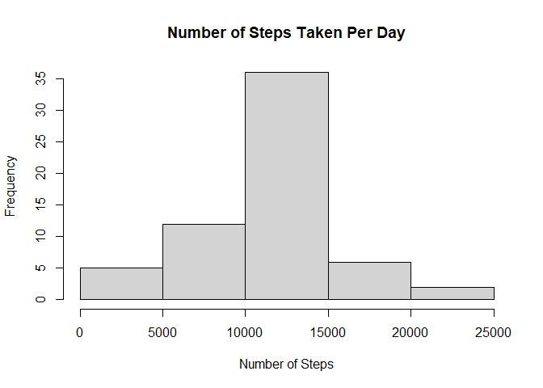
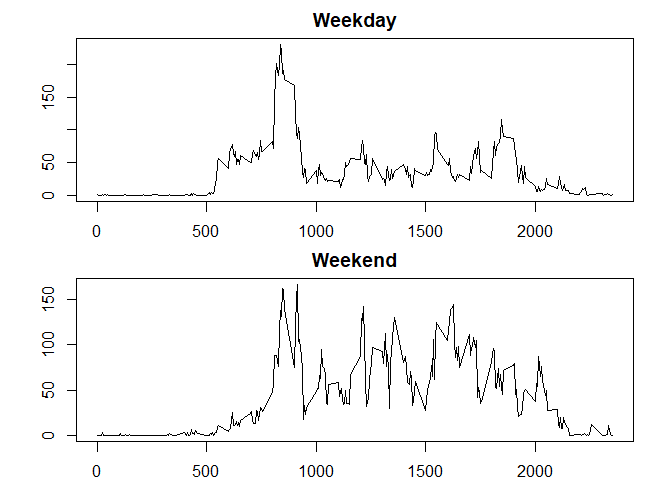

## Loading and preprocessing the data


```r
library(ggplot2)
library(dplyr)
```

```
## 
## Attaching package: 'dplyr'
```

```
## The following objects are masked from 'package:stats':
## 
##     filter, lag
```

```
## The following objects are masked from 'package:base':
## 
##     intersect, setdiff, setequal, union
```

```r
par(mfrow = c(1,1))

data <- read.csv("./activity.csv")
data$date <- as.Date(data$date)
```

## What is mean total number of steps taken per day?


```r
total <- tapply(data$steps, data$date, sum, na.rm = TRUE)
hist(total, main = "Number of Steps Taken Per Day", xlab = "Number of Steps")
```

<!-- -->

```r
data.frame(Mean = mean(total), Median = median(total))
```

```
##      Mean Median
## 1 9354.23  10395
```

## What is the average daily activity pattern?


```r
avg <- tapply(data$steps, data$interval, mean, na.rm = TRUE)
plot(as.integer(names(avg)), avg, type = "l", xlab = "Interval", ylab = "Average Number of Steps")
```

<!-- -->

The maximum number of steps is contained in the **835 interval**

## Imputing missing values


```r
NAs <- sum(is.na(data$steps))
data2 <- data

for (i in 1:17568) {
    if(is.na(data2[i, 1])) {
        data2[i, 1] <- avg[which(as.integer(names(avg)) == data2[i, 3])]
    }
}

total2 <- tapply(data2$steps, data2$date, sum)
hist(total2, main = "Number of Steps Taken Per Day", xlab = "Number of Steps")
```

<!-- -->

```r
data.frame(Mean = mean(total2), Median = median(total2))
```

```
##       Mean   Median
## 1 10766.19 10766.19
```

As calculated, the number of missing values is **2304**  
  
As expected, after imputing missing data the mean and median increased, and the histogram is more similar to a normal distribution in this case

## Are there differences in activity patterns between weekdays and weekends?


```r
data2 <- mutate(data2, weekday = ifelse(weekdays(date) == "sábado" | weekdays(date) == "domingo", "weekend", "weekday"))
data2$weekday <- as.factor(data2$weekday)

WD <- with(subset(data2, weekday == "weekday"), tapply(steps, interval, mean))
WND <- with(subset(data2, weekday == "weekend"), tapply(steps, interval, mean))
Xaxis <- as.integer(names(WD))

par(mfcol = c(2,1))
par(mar = c(2, 4, 2, 2))
plot(Xaxis, WD, type = "l", xlab = "", ylab = "", main  = "Weekday")
plot(Xaxis, WND, type = "l", xlab = "", ylab = "", main  = "Weekend")
```

<!-- -->
